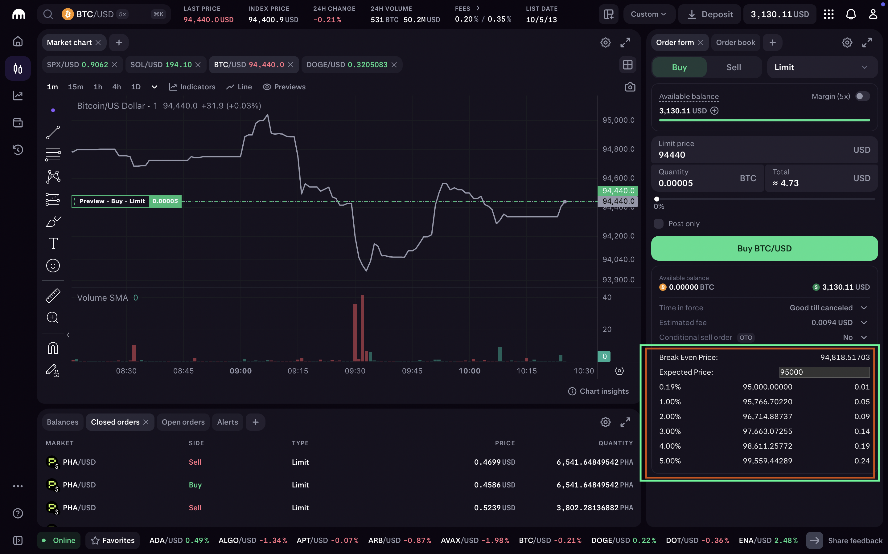

# Kraken Trading Helper

This Tampermonkey script helps you find the best selling price for your cryptocurrency trades on Kraken. It includes:

1. **Break-even Price**: Shows the minimum price to sell without losing money.  
2. **Profit Margins**: Lists selling prices for 1% to 5% profit.  
3. **Profit Calculator**: Quickly calculates your profit for any price.

## How to Install

1. Install the [Tampermonkey](https://www.tampermonkey.net/) browser extension.  
2. Turn on **Developer Mode** in your browser's extensions page (required by Tampermonkey).  
3. Get the script from [GreasyFork](https://greasyfork.org/en/scripts/521862-kraken-pro-trade-helper).  

## What It Looks Like

The output appears under the order form, like this:

